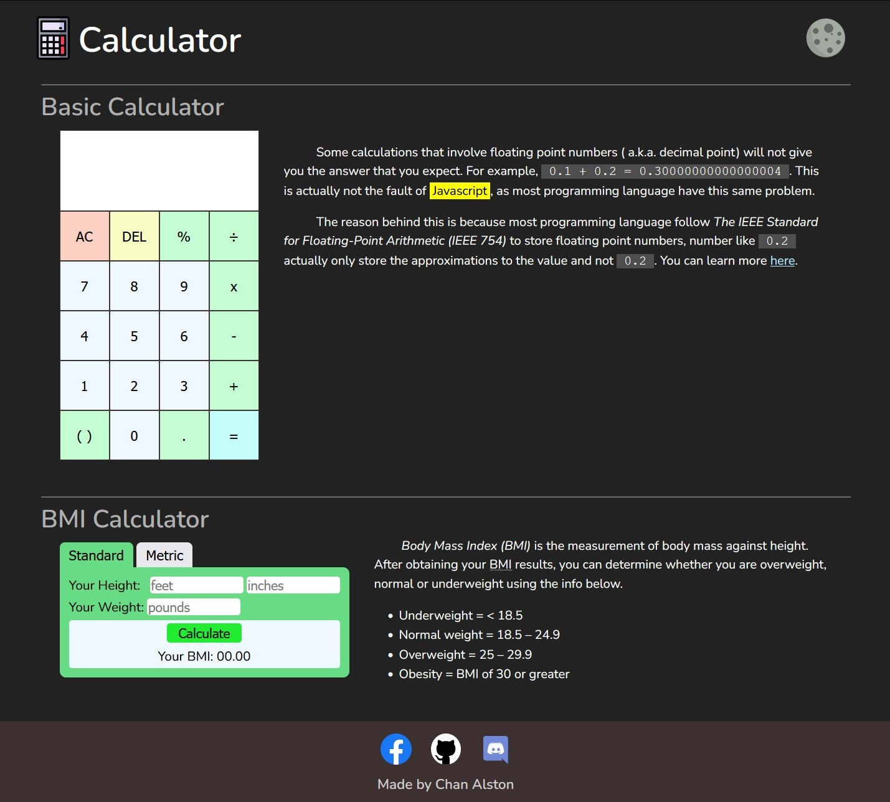

   
   
   

# Calculator

A calculator using only html, css and vanilla javascript, with **math.js**. There are two types of calculator, one is a **Basic Calculator** that is able to do some simple calculations and another one is **BMI Calculator**, which calculates your BMI index.

## Preview

  

## Feature

[x] Simple calculations
[x] Calculate BMI index
[x] Dark/Light mode

## Credits

Icons: [IconFinder](https://www.iconfinder.com/)
